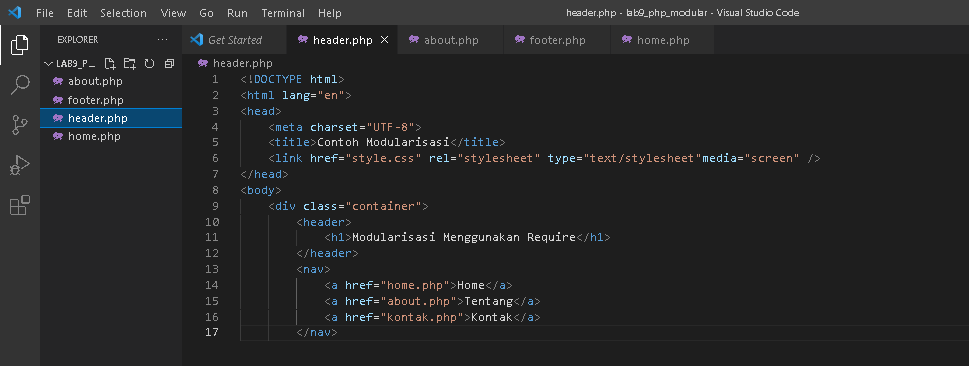
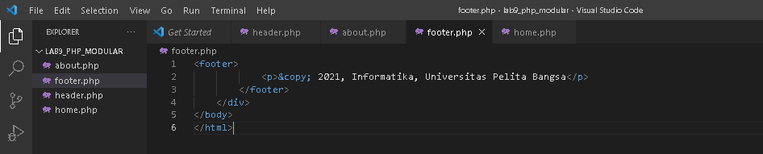
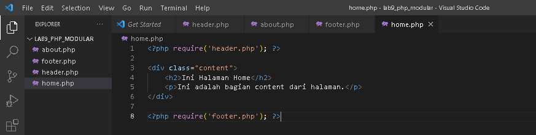
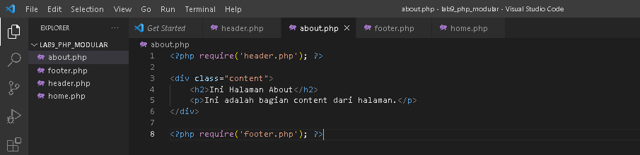
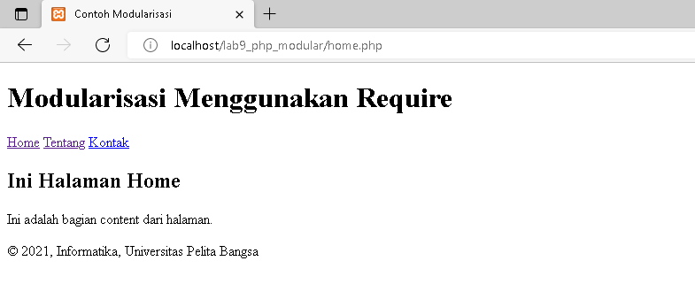
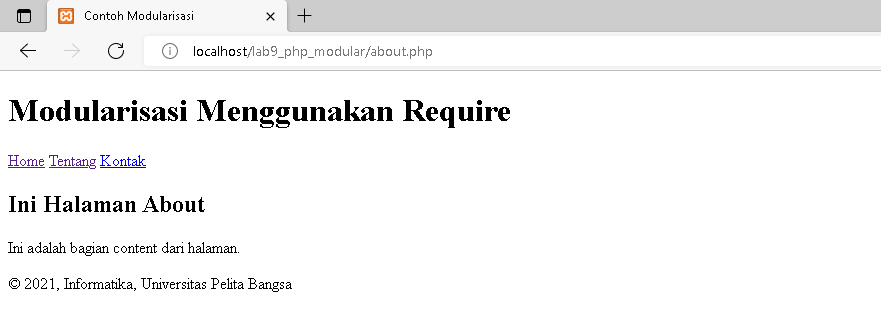

| Nama      | Aditya Bani Isro |
| ----------- | ----------- |
| NIM     | 312010134       |
| Kelas   | TI.20.A.1        |

## Langkah langkah praktikum 8

### 1. Buat file baru dengan nama header.php

### 2. Buat file baru dengan nama footer.php

### 3. Buat file baru dengan nama home.php

### 4. Buat file baru dengan nama about.php

### 5. Output
- Halaman Home

- Halaman About

## Pertanyaan dan Tugas
Implementasikan konsep modularisasi pada kode program praktikum 8 tentang database, sehingga setiap halamannya memiliki template tampilan yang sama.

## Jawaban