| Nama      | Aditya Bani Isro |
| ----------- | ----------- |
| NIM     | 312010134       |
| Kelas   | TI.20.A.1        |

# DAFTAR TUGAS

<table border="2" cellpading="10">
  <tr>
    <td><b>Praktikum 1</b></td>
    <td>HTML Dasar</td>
    <td><a href="https://github.com/Aditya-Bani/lab1web">Klik disini</td>
  </tr>
  <tr>
    <td><b>Praktikum 2</b></td>
    <td>CSS Dasar</td>
    <td><a href="https://github.com/Aditya-Bani/lab2web">Klik disini</td>
  </tr>
  <tr>
    <td><b>Praktikum 3</b></td>
    <td>Membuat List, Table dan Form</td>
    <td><a href="https://github.com/Aditya-Bani/lab3web">Klik disini</td>
  </tr>
  <tr>
    <td><b>Praktikum 4</b></td>
    <td>CSS Layout</td>
    <td><a href="https://github.com/Aditya-Bani/lab4web">Klik disini</td>
  </tr>
  <tr>
  <td><b>Praktikum 5</b></td>
    <td>Javascript</td>
    <td><a href="https://github.com/Aditya-Bani/lab5web">Klik disini</td>
</tr>
<tr>
  <td><b>Praktikum 6</b></td>
    <td>Web Framework</td>
    <td><a href="https://github.com/Aditya-Bani/lab6web">Klik disini</td>
</tr>
<tr>
  <td><b>Praktikum 7</b></td>
    <td>PHP Dasar</td>
    <td><a href="https://github.com/Aditya-Bani/lab7web">Klik disini</td>
</tr>
<tr>
  <td><b>Praktikum 8</b></td>
    <td>PHP dan Database MySQL</td>
    <td><a href=https://github.com/Aditya-Bani/lab8web">Klik disini</td>
</tr>
<tr>
  <td><b>Praktikum 9 & 10</b></td>
    <td>PHP Modular</td>
    <td><a href="https://github.com/Aditya-Bani/lab9web">Klik disini</td>
</tr>
<tr>
  <td></td>
    <td>PHP OOP</td>
    <td><a href="https://github.com/Aditya-Bani/lab10web">Klik disini</td>
</tr>
<tr>
    <td><b>Praktikum 11</b></td>
    <td>PHP Framework (Codeigniter)</td>
    <td><a href="https://github.com/Aditya-Bani/lab11web">Klik disini</td>
  </tr>
<tr>
    <td><b>Praktikum 12</b></td>
    <td>Framework Lanjutan (CRUD)</td>
    <td><a href="https://github.com/Aditya-Bani/lab11web">Klik disini</td>
  </tr>
<tr>
    <td><b>Praktikum 13</b></td>
    <td>Framework Lanjutan (Modul Login)</td>
    <td><a href="https://github.com/Aditya-Bani/lab11web">Klik disini</td>
  </tr>
  <tr>
    <td><b>Praktikum 14</b></td>
    <td>Pagination dan Pencarian</td>
    <td><a href="https://github.com/Aditya-Bani/lab11web">Klik disini</td>
  </tr>
  <tr>
</table>_________________________________________________________________________________
_________________________________________________________________________________

# Praktikum 9 | PHP Modular

## Langkah langkah praktikum 9

### 1. Buat file baru dengan nama header.php


### 2. Buat file baru dengan nama footer.php


### 3. Buat file baru dengan nama home.php


### 4. Buat file baru dengan nama about.php


### 5. Output
- Halaman Home


- Halaman About


## Pertanyaan dan Tugas
Implementasikan konsep modularisasi pada kode program praktikum 8 tentang database, sehingga setiap halamannya memiliki template tampilan yang sama.

## Berikut struktur yang saya buat
Lab9_php_database
```
├── config
│   ├── hapus.php
│   ├── koneksi.php
│   ├── tambah.php
│   └── ubah.php
├── layouts
│   ├── footer.php
│   ├── head-static.php
│   ├── header.php
│   ├── main.php
│   ├── tambah.php
│   └── ubah.php
├── static
│   ├── css
│   │   └── style.css
│   └── img
├── index.php
├── tambah.php
└── ubah.php
```

## Config 
Dalam folder tersebut menyimpan file khusus php yang nanti akan dieksekusi

- koneksi.php
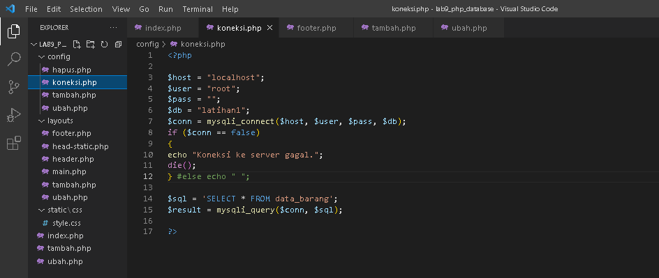

- tambah.php
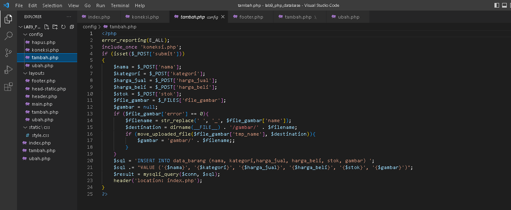

- ubah.php
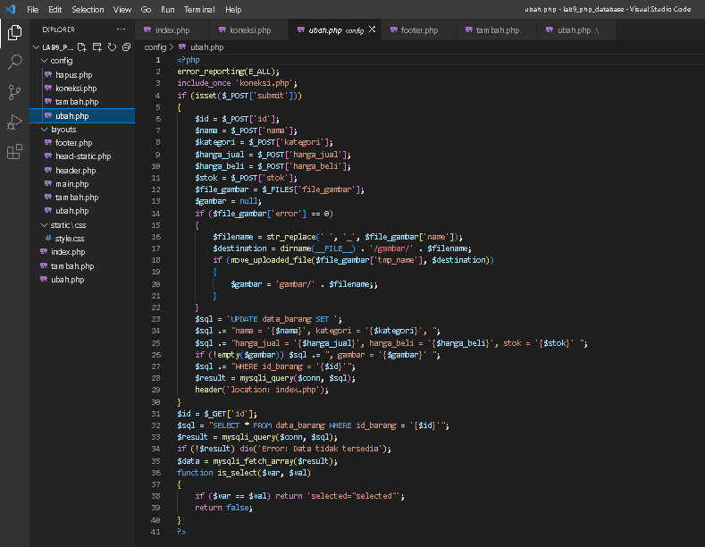

- hapus.php
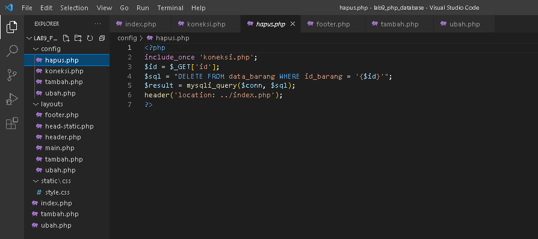

## Layouts
Untuk menyimpan tampilan utama pada website, dan dibagi pada beberapa file

- head-static.php
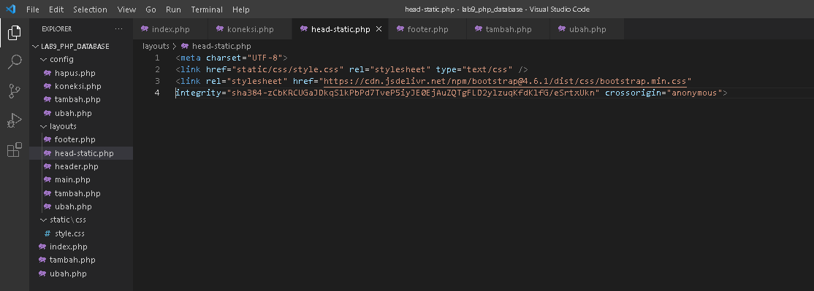

- header.php
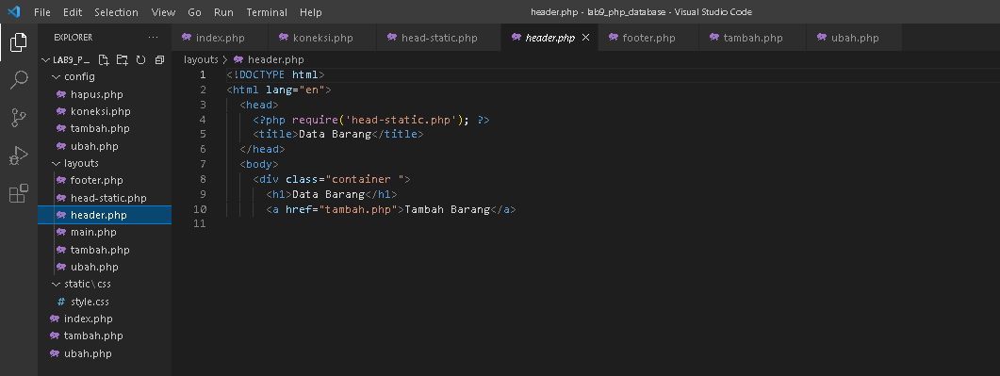

- main.php
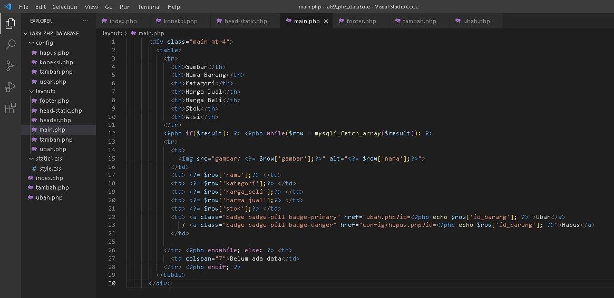

- footer.php
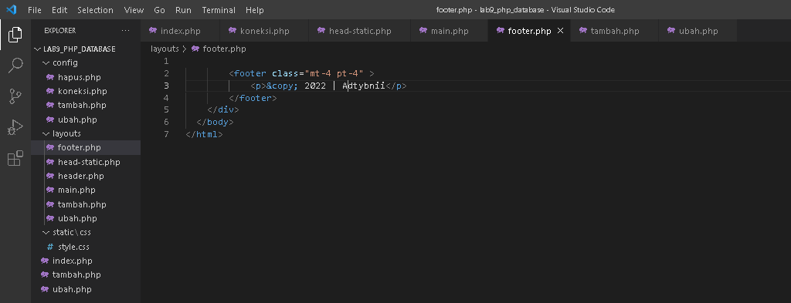

## Static
Untuk menyimpan file yang diperlukan seperti css, js, gambar

- style.css
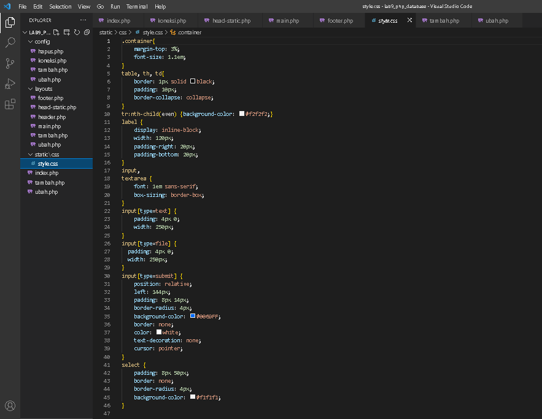

## index.php, tambah.php, ubah.php
File utama dan berfungsi sebagai wadah untuk memanggil sub-file di beberapa direktori

- index.php
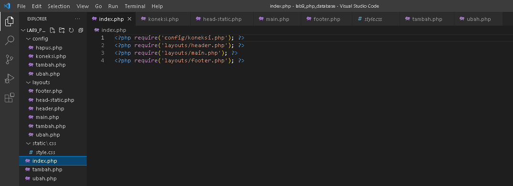

- tambah.php
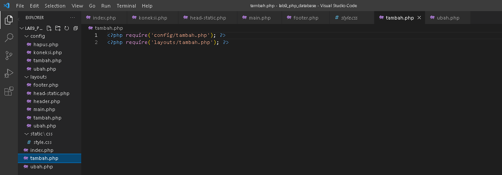

- ubah.php
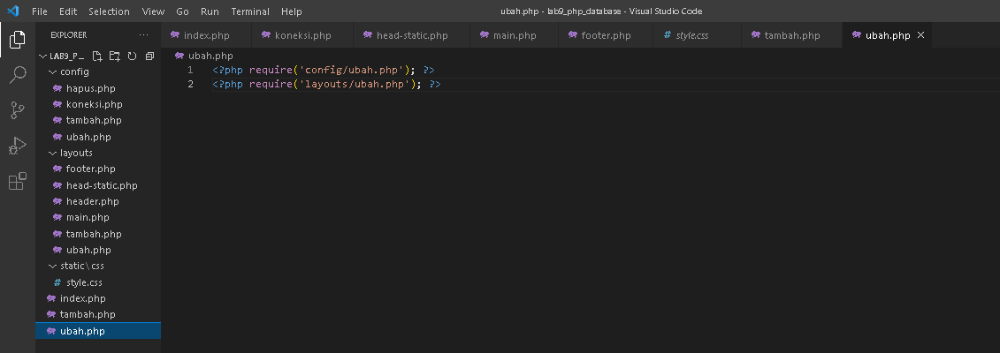

# Output
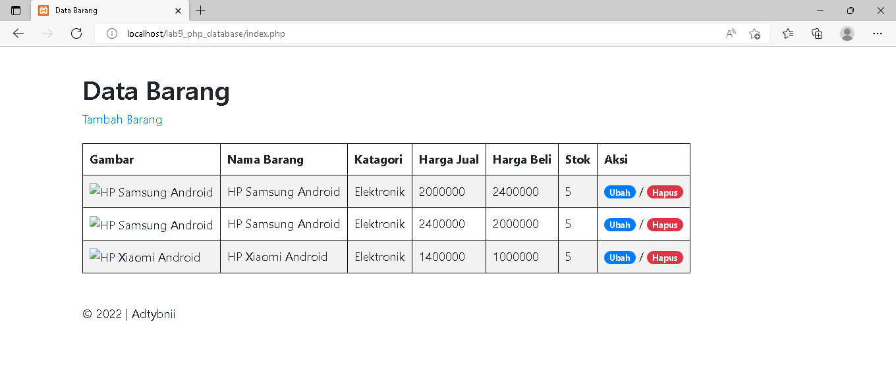

- Tambah barang
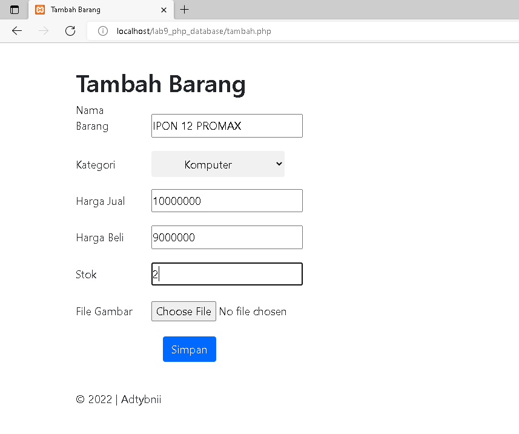

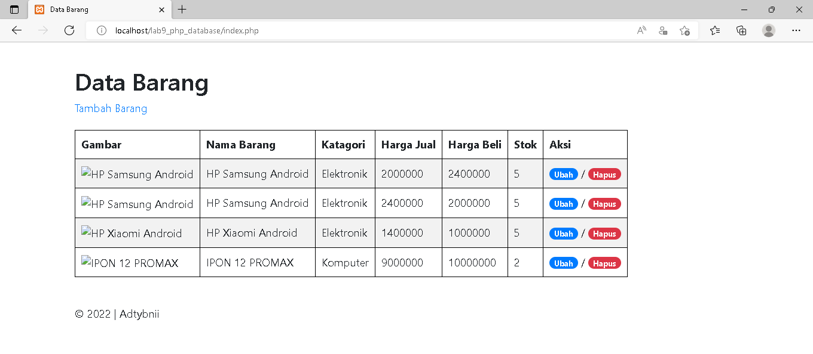

- Ubah barang
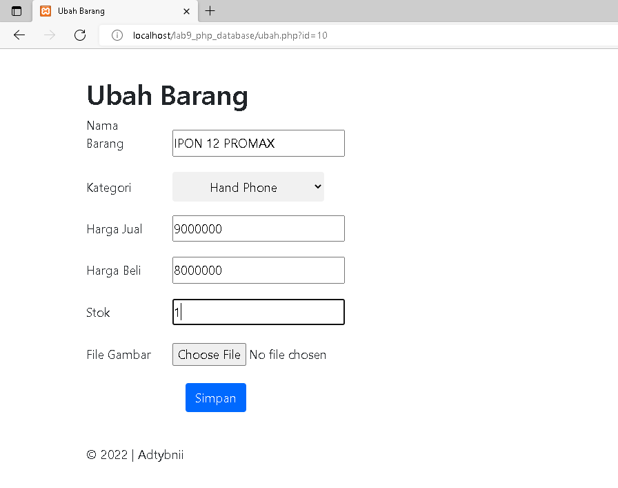

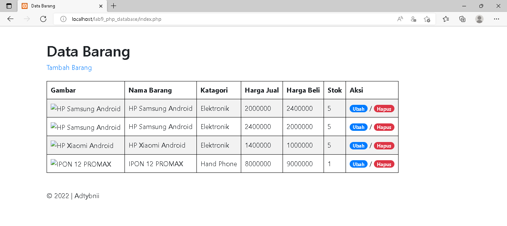
